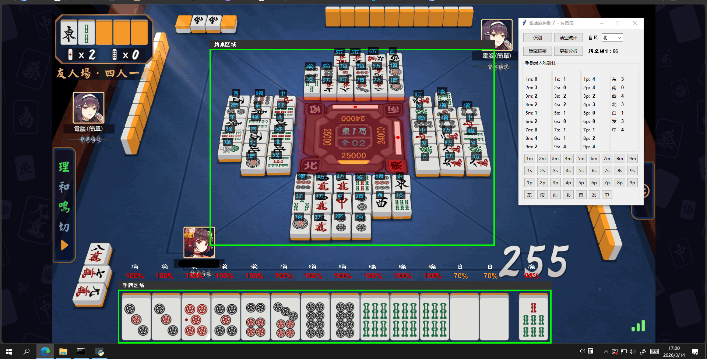
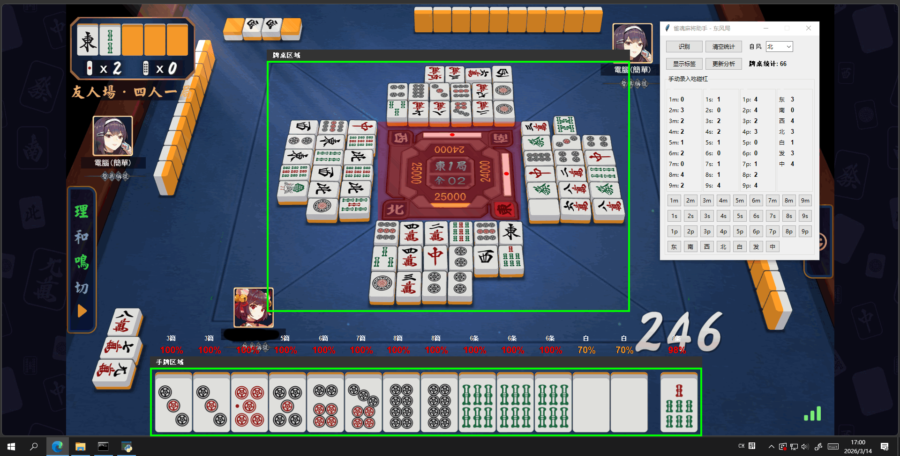
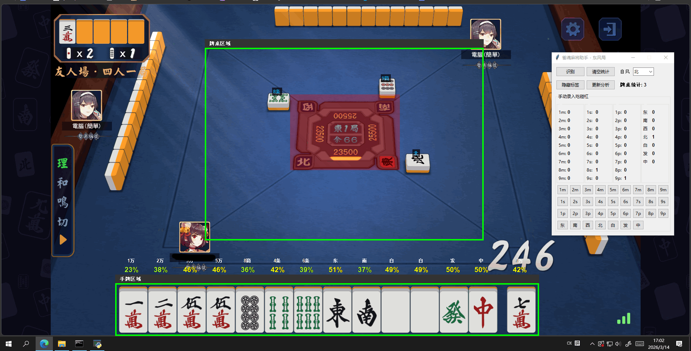

# mahjong_helper
雀魂麻将助手，灵感来自FF14麻将内置功能（理论上也可以根据手牌情况加提示）
## 核心功能
- 识别牌面信息，统计/清空数据
- 手动微调数据，用于统计吃碰杠的麻将牌
- 手牌危险度预测（玄学仅作参考）
## 项目环境
- Python 3.10.11
- WIN10 1920x1080
- 不同环境可能需要调整模板图片及相应参数
## 使用说明
### 一、前期准备
游戏中麻将牌所有形态模板图：可使用项目创建工具，也可使用任意截图工具制作
- generator_templates.py：快速截图命名templates文件夹下模板图
- generator_panzhuo.py：快速截图命名panzhuo文件夹下模板图
### 二、初始化设置
- 牌桌区域：拖拽边框更改范围，绿色边框
- 手牌区域：拖拽边框更改范围，绿色边框
- 排除区域：拖拽边框更改范围，红色遮罩，用于排除中间转盘减少干扰
- 选择当前的“自风”
- 每次关闭程序会自动保存配置，无需重复设置
### 三、识别分析
- 点击“识别”，目前最多等待20s左右，关注命令行输出
- 牌桌区域会显示识别到的麻将牌名，点击显示/隐藏标签切换
- 手牌区域会显示麻将牌名与危险度预测
### 注意事项
- 如果有吃碰杠情况，点击下方按钮组对应麻将牌调整数据后，点击“更新分析”更新危险度预测
- 对局过程中麻将牌有时会反光，务必在间隙点击识别
- 本项目只打东风局，娱乐为主
#### 危险度预测
- 项目未作立直、宝牌识别，因此未细化这方面计算
- 手牌未加入统计，因此自己凑好牌时也会增加某些牌的危险度，逻辑没想清楚
## 运行图片

